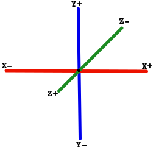
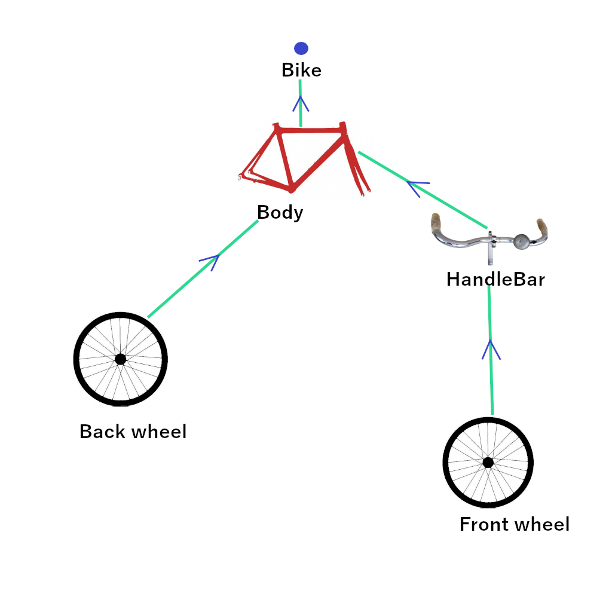

# Engine 3D

1. [Introduction](#introduction)
2. [What is a 3D engine](#what-is-a-3d-engine)
   1. [Space coordinates](#space-coordinates)
   2. [Scene organization](#scene-organization)
3. [How to use this 3D engine](#how-to-use-this-3d-engine)
   1. [XML initialization](#xml-initialization)
   2. [Compose initialization](#compose-initialization)
   3. [Scene creation](#scene-creation)
4. [Behind the scene how does it work](#behind-the-scene-how-does-it-work)

## Introduction

The aim of a 3D engine is to able add 3D scene inside application.
Our code will provide a XML component and compose component to add the scene inside any application 
like image, text, button, ... 

## What is a 3D engine

### Space coordinates
A 3D engine represents scene in 3 dimensions. 
Like in real life we experience 3 dimensions :
* Horizontal, called in math abscissa and notate **X**. By convention it is oriented for left to right
* Vertical, called in math ordinate and notate **Y**. By convention it is oriented for bottom to top
* Depth, called in math depth and notate **Z**. By convention it is oriented for far to near

The center of the scene is the center of the screen oriented to see far, that's why we will see the only see thing on negative **Z**



### Scene organization
A 3D scene contains nodes. Nodes are virtual object, or real one. 
They have a position, rotation and scale factor along axis.
If a node have children, children are place relative to parent's position, orientation and zoom. 
That is to say change a node position, rotation or scale factor will change its children, grand children, ...
But not change the node's parent.

An example, for represents a very simple bike, we will need two wheels, a body and handlebar

* The main part off the bike is its body, evey position it take, all other parts must follow, 
so all other parts will be its child (or grand child, grand grand child, ...)
* The back wheel will turn on it self and be directly attached to the body
* The front wheel must also follow handle bar move, so must be child of handlebar. 

Result :



The arrows means : child of

If you look image upside down you will see a sort of tree, that's why we say 3D scene are organize in tree

Here the scene have a special node called **root** all objects in the scene will be on its family tree.
Move the **root** will move the all scene.

## How to use this 3D engine

First think need is the component to show the scene first. 

Their are two versions :
* One can be used in XML : [fr.jhelp.tools.engine3d.view.View3D](../../Engine3D/src/main/java/fr/jhelp/tools/engine3d/view/View3D.kt)
* Other can be used in jetpack compose : [fr.jhelp.tools.engine3d.view.View3DComposable](../../Engine3D/src/main/java/fr/jhelp/tools/engine3d/view/View3DComposable.kt)

### XML initialization

First refer to `View3D` in layout XML (For example) :

```xml
    <fr.jhelp.tools.engine3d.view.View3D
        android:id="@+id/view3D"
        android:layout_width="match_parent"
        android:layout_height="match_parent" />
```

The get it in code

```kotlin
import fr.jhelp.tools.engine3d.view.View3D
// ...
    /**
     * Called when activity is created
     */
    @MainThread
    override fun onCreate(savedInstanceState: Bundle?)
    {
        super.onCreate(savedInstanceState)
        this.setContentView(R.layout.activity_3d_game)
        val view3D: View3D = this.findViewById(R.id.view3D)
        view3D.tree {
            // Create the scene
        }
        // ...
    }
// ...
```

For create the scene see here [Scene creation](#scene-creation)

### Compose initialization

In compose use `View3DComposable` :

```kotlin
import fr.jhelp.tools.engine3d.view.View3DComposable
import java.lang.reflect.Modifier

// ...
{
   // ...
   private val view3DComposable = View3DComposable()

   @Composable
   fun Draw(modifier: Modifier=Modifier)
   {
       // ...
       this.view3DComposable.Draw(modifier=modifier) {
          // Create the scene
       }
       // ...
   }
}
```

For create the scene see here [Scene creation](#scene-creation)

### Scene creation

What ever the initialization, the scene creation is the same, 
so after this point we will not differentiate if we are in compose or not.

In scene creation their direct access to the embed `View3D` and `Scene` to allow developers crete their scene in another place easily. 
It is also possible to use a **DSL** way.

To change the scene background color, you can use the field `backgroundColor` of `Scene3D` instance or 
use the shortcut `backgroundColor` in the DSL

```kotlin
import fr.jhelp.tools.engine3d.scene.LIGHT_BLUE
// ...

{
    // Create the scene
   backgroundColor = LIGHT_BLUE
}
```

To be able see some thing easily, we recommend to move the scene in font the user (by default it is at same place).

To do that either get the root of the scene like this :

```kotlin
   scene3D.root.position { z = -2f }
```

Or use DSL like that

```kotlin
{
   // Create the scene
   scenePosition { z = -2f }
}
```

To add a node, an empty node to group nodes/object

Not DSL

```kotlin
import fr.jhelp.tools.engine3d.scene.Node3D
// ...
    val node = Node3D()
    scene3d.root.add(node)
// ...
```

DSL 

```kotlin
import fr.jhelp.tools.engine3d.dsl.nodeReference

{
   // Create the scene
   val nodeReference = nodeReference()
   root {
     node(nodeReference) {
         // ...
     }        
   } 
}
```

With the bike example from [Scene organization](#scene-organization) :


In no DSL :

```kotlin
import fr.jhelp.tools.engine3d.scene.*
// ...
    val bike = Node3D()
    val body = body()
    val backWheel = wheel()
    val frontWheel = Clone3D(backWheel) 
    val handlebar = handlebar()
    scene3d.root.add(bikr)
    bike.add(body)
    body.add(backWheel)
    body.add(handlebar)
    handlebar.add(frontWheel)
// ...
private fun body() : Object3D
{
  TODO()    
}

private fun wheel() : Object3D
{
   TODO()
}

private fun handlebar() : Object3D
{
   TODO()
}
```

In DSL

```kotlin
import fr.jhelp.tools.engine3d.scene.*
import fr.jhelp.tools.engine3d.dsl.*

{
    // Create scene
    val (bike, body, backWheel, handlebar, frontWheel) =  nodeReferences()
   root {
       node(bike) {
          children {
             object3D(body) {
                 // TODO locate and create object 
                 chidlren {
                     object3D(backWheel) {
                        // TODO locate and create object
                     }
                    
                    object3D(handlebar) {
                       // TODO locate and create object
                       chidlren {
                           clone(frontWheel, backWheel) {
                              // TODO locate clone
                           }
                       }
                    }
                 }
             }
          }
       }
   }
}
```

It is possible to mix DSL and not DSL way.
In DSL way use no DSL way is just call method of current node.

In no DSL, for example their have `children` extension for `Node3D`  in [fr.jhelp.tools.engine3d.dsl.Node3DExtensions](../../Engine3D/src/main/java/fr/jhelp/tools/engine3d/dsl/Node3DExtensions.kt)  
that permits to create hierarchy in **DSL** way.

A detailed tutorial can be found here : [Tutorial for use the engine 3D](tutorial/TutorialEngine3D.md)

## Behind the scene how does it work

