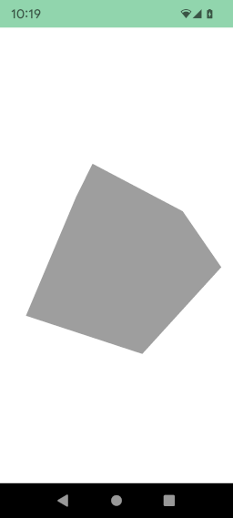

# 3D version of hello world

At the end of this tutorial we will obtain a grey cube like :



Standard way to add the cube

```kotlin
import fr.jhelp.android.library.engine.scene.geometry.Box
// ...
        scene3D.root.add(Box())

        // ...
```

If you launch the code like this, you will still see a white screen. 
Its because we are inside the cube and the inside is not drawing. 
To see the cube, we have to push the scene forward.

```kotlin
import fr.jhelp.android.library.engine.scene.geometry.Box
// ...
        scene3D.root.position.z = -2f
        scene3D.root.add(Box())
// ...
```

So now we have the grey cube.
By default touch the 3D view make the scene turn, so slide finger on screen to rotate the cube.

### DSL way

Add the cube

```kotlin
import fr.jhelp.android.library.engine.extensions.tree
import fr.jhelp.android.library.engine.view.View3D
// ...
        view3D.tree {
            this.root { box() }
        }
// ...
```

If you launch the code like this, you will still see a white screen.
Its because we are inside the cube and the inside is not drawing.
To see the cube, we have to push the scene forward.

```kotlin
import fr.jhelp.android.library.engine.extensions.tree
import fr.jhelp.android.library.engine.view.View3D
// ...
        view3D.tree {
            this.scenePosition { this.z = -2f }
            this.root { this.box() }
        }
// ...
```

So now we have the grey cube.
By default touch the 3D view make the scene turn, so slide finger on screen to rotate the cube.

