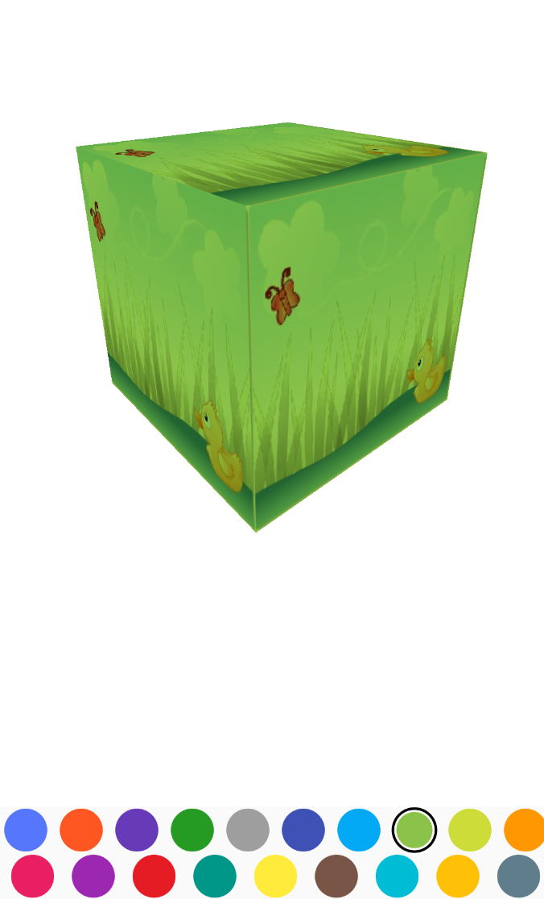
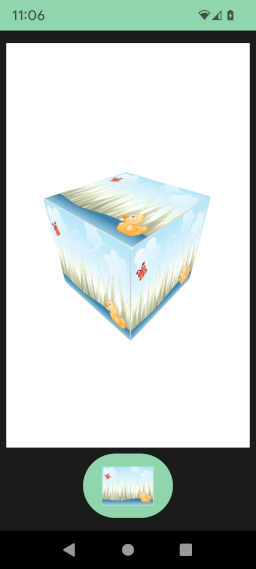

# Material and texture

In [3D version of hello world](../helloWorld/HelloWorld3D.md) we drew a grey cube.
Here we will learn how to change the color and put image on it.

* [Material](#material) : Material description and creation
* [Texture](#texture) : Create a texture



Sample code : [Engin3DMaterialComposable](../../../../app/src/main/java/fr/jhelp/tools/ui/composables/engine3d/Engin3DMaterialComposable.kt)

## Material

A material describes how render a 3D object.
For this we use the class [fr.jhelp.tools.engine3d.scene.Material](../../../../Engine3D/src/main/java/fr/jhelp/tools/engine3d/scene/Material.kt)

It have 3 fields :

| Field name | Description                                                                                                                                                                      |
|:----------:|:---------------------------------------------------------------------------------------------------------------------------------------------------------------------------------|
|   alpha    | It defines the opacity level of the object in [[0, 1]].<br/>More the value is near 1, more object will be opaque.<br/>More the value is near 0, more object will be transparent. |
|  diffuse   | Diffuse color on object.<br/>Diffuse color defines the base color of the object.<br/>Mix with texture it will tint it.                                                           |
|  texture   | Texture to use.<br/>A texture is an image applies to an object.                                                                                                                  |

By default each object have its own `Material` instance, but it may b a good idea to create one instance and share it to several object.

So the material's object can be directly change :

```kotlin
// ...
    val box = Box()
    // ...
    box.material.diffuse = RED
// ...
```

Material can be create and share to several object.

Classic way :

```kotlin
// ...
        val material = Material()
        material.diffuse = GREEN
        
        val box = Box()
        val sphere = Sphere()
        // ...
        box.material = material
        sphere.material = material
// ...
```

For **DSL** have to create a reference, fill the material, then share the reference

```kotlin
// ...
        view3D.tree {
            // Create a material reference
            val materialReference = materialReference()
        
            // Fill the material
            material(materialReference) {
                this.diffuse = BLUE
            }
        
            this.root {
                this.box {
                    this.material(materialReference)
                }
            }
        }
// ...

```

It is possible to create several material references in one time :

```kotlin
// ...
        // Create some material references
        val (materialReference1, materialReference2, materialReference3) = materialReferences()
        
        // Fill the material
        material(materialReference1) {
            this.diffuse = BLUE
        }
// ...

```

the method `materialReferences` can create until 16 materials in one time. For more, have to separate the creation.

```kotlin
import fr.jhelp.android.library.engine.dsl.materialReferences

// ...
val (materialReference1, materialReference2, materialReference3, materialReference4,
    materialReference5, materialReference6, materialReference7, materialReference8,
    materialReference9, materialReference10, materialReference11, materialReference12,
    materialReference13, materialReference14, materialReference15, materialReference16) = materialReferences()
val (materialReference17, materialReference18, materialReference19, materialReference20) = materialReferences()
// ...

```

## Texture

Texture is an image applied to a 3D object, like :



The image source can be the drawable folder, the assets, a `android.graphics.Bitmap`, draw by the developer or get from any stream.

A texture can be sealed or not.
If the texture is not seal it is possible to modify it, by drawing on it.
To save RAM memory, a texture can be seal, bu after that it can't be modified.

To have a [fr.jhelp.tools.engine3d.scene.Texture](../../../../Engine3D/src/main/java/fr/jhelp/tools/engine3d/scene/Texture.kt)
instance there different ways.

One is to use functions store in [fr.jhelp.tools.engine3d.resources.Textures](../../../../Engine3D/src/main/java/fr/jhelp/tools/engine3d/resources/Textures.kt)
file :

```kotlin
// ...
    // Initialized with default texture
    var texture = defaultTexture()
// ...
    // Get from drawable
    texture = texture(resources, R.drawable.image, sealed = true)
// ..
    // Empty texture to draw on it
    texture = texture(512, 512)
// ...
    // Texture from stream
    texture = texture({url.openStram()}, sealed = false)
// ...
    // Texture form bitmap 
    texture = texture(bitmap, sealed = false)
// ...
    // Texture from image source (See further in this documentation for what is an image source)
    texture = texture(imageSource, sealed = true)
// ...
    // Texture to play a video
    texture = TextureVideo()
```

If texture is not sealed it is possible to draw on it :

```kotlin
import fr.jhelp.android.library.engine.scene.draw

// ...
    textureImage.drawOnTexture { bitmap, canvas, paint -> 
        // ...
    }
// ...
```

Inside the lambda
* `bitmap` is the bitmap that contains the texture image,
* `canvas` is the canvas tool to draw/fill line, rectangle, oval, ...
* `paint` is the paint tool for choose color, stroke width, ...

You can use their also our image manipulation tools see [Images documentation](../../images/ImagesDocumentation.md)

Another way tho create texture is to use [fr.jhelp.tools.engine3d.resources.ResourcesAccess](../../../../Engine3D/src/main/java/fr/jhelp/tools/engine3d/resources/ResourcesAccess.kt)

It is possible to use it if application context is provided or `View3D` (or its composable version) is used and was show at least one time

```kotlin
// ...
    val textureDrawable = ResourcesAccess.obtainTexture(R.drawable.image, sealed = true)
    val textureAsset = ResourcesAccess.obtainTexture("asset/path/image.png", sealed = false)
```

For **DSL** way for create texture first create reference, associate it a description and can be applied to a material.

Creates one reference :

```kotlin
    view3D.tree {
        val textureReference = textureReference()
    }
```

Can create several textures references in one time :

```kotlin
    view3D.tree {
        val (textureReference1, textureReference2, textureReference3) = textureReferences()
    }
```

Like material, the number of references can be created in one time is limited to 16, for more cut the creation

```kotlin
    view3D.tree {
        val (textureReference1, textureReference2, textureReference3, textureReference4,
            textureReference5, textureReference6, textureReference7, textureReference8,
            textureReference9, textureReference10, textureReference11, textureReference12,
            textureReference13, textureReference14, textureReference15, textureReference16) = textureReferences()
        val (textureReference17, textureReference18, textureReference19, textureReference20) = textureReferences()
    }
```

For associate reference to a texture, use one of `texture` methode version :

```kotlin
    view3D.tree {
        val (textureReferenceDrawable, textureReferenceAsset, textureReferenceDraw, textureReferenceImageSource) = textureReferences()

        // Associate to a drawable resource
        texture(textureReferenceDrawable, R.drawable.body_costume)
        // Associate to an asset
        texture(textureReferenceAsset, assetPath = "images/background.png")
        // Associate to image draw
        texture(textureReferenceDraw, 512, 512) { bitmap, canvas, paint ->
            // ...
        }
        // Associate to an image source
        texture(textureReferenceImageSource, imageSource)
    }
```

Once reference is associated, it can be used with a material

```kotlin
    view3D.tree {
        val textureReference = textureReference()
        texture(textureReference, R.drawable.body_costume)
        val materialReference = materialReference()
        material(materialReference) {
            this.diffuse = WHITE
            this.textureReference = textureReference
        }
    }
```

The texture reference can be used in several materials :

```kotlin
    view3D.tree {
        val textureReference = textureReference()
        texture(textureReference, R.drawable.body_costume)
        val (materialReference, materialReferenceRedTint) = materialReferences()
        material(materialReference) {
            this.diffuse = WHITE
            this.textureReference = textureReference
        }
        material(materialReferenceRedTint) {
            this.diffuse = RED
            this.textureReference = textureReference
        }
    }
```
