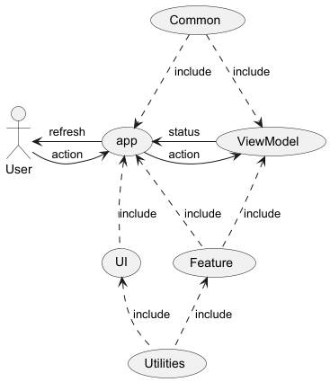

# Show case

The show case is actually in modules point of view :

Show case contains in main screen a list of features to show. 
When click on feature a feature screen appear.

Their the main activity show the current screen, pilot with a navigation feature.
A screen with features list.
A screen for each feature.
